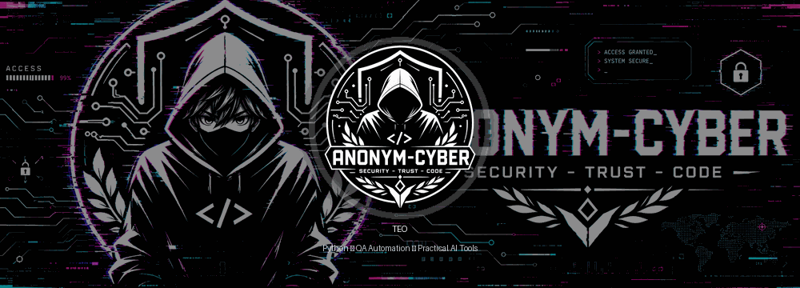

  

<h1 align="center">Hi, I'm Teo</h1>

  Junior Python developer in training, focused on QA automation, deterministic tools, and AI-assisted engineering workflows.

  <a href="https://github.com/teogame3d-alt/teogame3d-alt-portfolio">Technical Portfolio</a>
  &nbsp;|&nbsp;
  <a href="https://teogame3d-site.pages.dev/">3D Portfolio</a>
  &nbsp;|&nbsp;
  <a href="https://github.com/teogame3d-alt?tab=repositories">Repositories</a>

---

## About Me

I came back to programming through curiosity, discipline, and the wish to understand how software can make real work clearer.

My focus is on projects that are small enough to understand deeply, but structured enough to be reviewed like real engineering work: deterministic logic, readable architecture, tests, CI, data validation, desktop interfaces, and AI-assisted workflows.

I like building systems where behavior can be inspected instead of guessed. If a tool makes a decision, I want to know why. If data is cleaned, I want the validation path to be visible. If an interface exists, I want it to help the user move with less friction.

---

## Current Focus

- Python application structure with `src/`, `tests/`, docs, and CI
- QA automation with `pytest`, API checks, and regression-safe workflows
- SQLite-backed desktop tools with PyQt6
- Data cleaning, validation, and interactive visualization
- Deterministic AI-style assistants and explainable text automation
- PR workflows with feature branches, review feedback, regression tests, and CI-oriented validation
- Frontend and portfolio presentation for technical work

---

## Featured Engineering Projects

| Project | What it shows |
| --- | --- |
| [AI Agent Text RO](https://github.com/teogame3d-alt/ai-agent-text-ro) | Deterministic Romanian/English text automation, SQLite memory, PyQt6 UI, tests, CI |
| [Interactive Data Viz](https://github.com/teogame3d-alt/interactive-data-viz) | Reproducible data cleaning, validation reports, interactive charts, algorithm visualizers |
| [PyQt6 Magic Shop](https://github.com/teogame3d-alt/pyqt6-magic-shop) | Desktop CRUD app with service/repository layers, SQLite persistence, and tested business rules |
| [Digital Library](https://github.com/teogame3d-alt/digital-library) | Compact OOP model with borrow/return state transitions, JSON persistence, and tests |
| [QA Automation API Suite](https://github.com/teogame3d-alt/qa-automation-api-suite) | API smoke tests, response contract checks, negative-path validation, GitHub Actions |

For a fuller technical review path, see the [Technical Portfolio Index](https://github.com/teogame3d-alt/teogame3d-alt-portfolio).

---

## Review Signals

- Each project is intentionally scoped so the behavior can be inspected quickly.
- READMEs focus on problem, solution, setup, tests, and design decisions.
- Tests and CI are used where repeatable behavior matters.
- AI-assisted work is treated as something to verify, document, and understand.

---

## Tech Stack

  
  
  
  
  
  
  

---

## How I Build

- I prefer clear behavior over black-box magic.
- I write tests for the parts that should not silently break.
- I keep projects small, documented, and easy to review.
- I use AI as a thinking and development assistant, not as a replacement for understanding.
- I care about the bridge between technical correctness and human usability.

---

## Direction

I am growing toward QA automation, Python tooling, and practical AI-assisted software. My long-term interest is the space where computers help people think, work, learn, and stay organized with less noise.

Programming feels most meaningful to me when it turns scattered effort into something structured, repeatable, and useful.

---

## Links

- Portfolio: [teogame3d-site.pages.dev](https://teogame3d-site.pages.dev/)
- GitHub: [@teogame3d-alt](https://github.com/teogame3d-alt)
